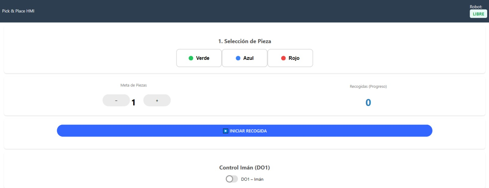
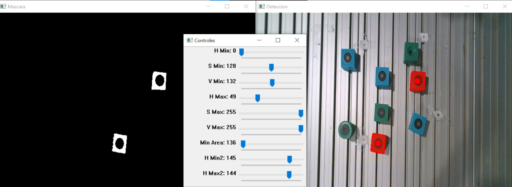

# ABB GoFa 10 — Vision-Guided Pick & Place


> Autonomous pick & place system integrating real-time computer vision, TCP/IP communication, a custom FlexPendant web HMI, and ABB RAPID robot programming — built on an ABB GoFa 10 collaborative robot.

---

## Features

- **Multi-color detection** — identifies 4 cube colors (yellow, blue, red, green) via HSV segmentation
- **Pixel → mm coordinate transform** — calibrated homography matrix maps camera pixels to the robot's coordinate frame with < 5 mm RMS error
- **Real-time streaming** — Python client sends coordinates to the robot controller at ~30 fps over TCP/IP
- **Two operating modes** — switchable via a single RAPID flag (`usePLC`):
  - **HMI mode** — operator selects color and quantity through a custom web interface on the FlexPendant
  - **PLC mode** — cycle triggered by hardwired digital input signals (DI1/DI2), ready for SCADA/PLC integration
- **Grid-based storage** — picked objects are automatically arranged in a 3×3 grid (160 mm spacing)
- **Interactive calibration tools** — HSV parameter tuner and homography calibration utility included

---

## System Architecture

```
┌─────────────────────────────┐
│   FlexPendant Web HMI       │  Operator selects color + quantity
│   HTML / JS / OmniCore SDK  │  Sets startPick, reads robotBusy
└────────────┬────────────────┘
             │ RAPID shared variables (HMIData.mod)
             ▼
┌─────────────────────────────┐
│   ABB RAPID Controller      │  TCP server on port 1025
│   VisionPickPlace.modx      │  Executes pick-place motion sequence
└────────────┬────────────────┘
             │ TCP/IP socket — "XXXYYYY" coordinate strings
             ▼
┌─────────────────────────────┐
│   Python Vision Client      │  OpenCV color segmentation
│   ClienteGoFa_imagen.py     │  Homography transform → mm coords
└────────────┬────────────────┘
             │ USB
             ▼
┌─────────────────────────────┐
│   USB Camera (index 2)      │  640×480, fixed overhead mount
└─────────────────────────────┘
```

---

## Repository Structure

```
rob_industrial/
│
├── RAPID/                              # ABB RAPID robot modules
│   ├── HMIData.mod                     # Shared variables bridge (HMI ↔ RAPID)
│   ├── VisionPickPlace.modx            # Main pick & place logic
│   ├── VisionPickPlace_cuadricula.modx # Grid-based storage variant
│   └── CalibData.modx                  # Tool definitions & calibration targets
│
├── lab3_pick_place_VC/
│   └── client-tcpip-gofa/
│       ├── ClienteGoFa_imagen.py       # Vision client — main entry point
│       ├── calibrar_homografia.py      # Interactive homography calibration tool
│       ├── ajuste_parametros_colores.py# Interactive HSV color tuning tool
│       ├── mock_robot.py               # TCP simulator for testing without robot
│       ├── homography.json             # Calibrated pixel→mm matrix
│       └── config_cubos_*.json         # Per-color HSV parameter profiles
│
├── lab_HMI/
│   └── webapp/                         # FlexPendant web HMI
│       ├── index.html                  # Operator interface
│       ├── app.js                      # Signal control & RAPID variable access
│       ├── app.css                     # Styling
│       ├── fp-components/              # ABB FlexPendant UI component library
│       └── rws-api/                    # ABB OmniCore RWS client library
│
├── images/                             # Screenshots used in this README
└── doc/                                # Lab documentation & reference images
```

---

## How It Works

### 1. Computer Vision

The Python client captures frames from a USB camera mounted above the workspace and processes them in real time.

**Color detection** uses HSV segmentation. Each color has an independent JSON profile tuned for the specific lighting conditions of the workspace:

| Color | Hue range | Notes |
|-------|-----------|-------|
| Yellow | 20–30 | — |
| Blue | 100–125 | — |
| Red | 0–5 and 175–179 | Bimodal (wraps around 0°) |
| Green | 40–80 | — |

**Coordinate transform**: Once the centroid of a detected cube is found in pixels, the homography matrix converts it to millimeters in the robot's `wobj0` frame. The resulting `(x_mm, y_mm)` pair is packed into a 6-character string (`XXXYYYY`) and sent to the RAPID controller over the TCP socket.

---

### 2. RAPID Robot Controller

The RAPID code (`VisionPickPlace.modx`) acts as a TCP/IP server listening on **port 1025**. A single boolean flag in `HMIData.mod` switches between the two operating modes:

| | HMI Mode (`usePLC = FALSE`) | PLC Mode (`usePLC = TRUE`) |
|---|---|---|
| **Trigger** | Operator presses *Iniciar Recogida* on the web HMI | Digital input signal DI1/DI2 |
| **Color selection** | Dropdown / radio buttons in the webapp | Encoded in digital inputs |
| **Use case** | Standalone operation with operator | Integration with existing PLC/SCADA |

**Pick sequence** (per object):
1. Move to home position (`ptoReposo`)
2. Request coordinates from Python client via socket
3. Move 100 mm above detected cube (Joint move)
4. Descend to cube surface (Linear move, fine positioning)
5. Activate electromagnet (`Local_IO_0_DO1 = 1`)
6. Retract to approach height
7. Move to deposit position in the 3×3 grid
8. Release electromagnet, return home
9. Increment `piecesPickedCount`, update HMI status

---

### 3. Web HMI (FlexPendant WebApp)

The operator interface runs directly on the robot controller's touchscreen (FlexPendant), built with the **ABB OmniCore SDK 1.2**.

<p align="center">
  
</p>

**Controls:**
- Color selector (Verde / Azul / Rojo) mapped to `selectedColor` RAPID variable
- Piece quantity stepper (1–3) mapped to `piecesToPick`
- **INICIAR RECOGIDA** button → sets `startPick = TRUE`
- Real-time status indicator: **LIBRE** (idle) / **OCUPADO** (busy) from `robotBusy`
- Pick counter showing `piecesPickedCount`
- Manual electromagnet toggle (DO1) for maintenance

---

## Calibration

### Step 1 — Color Parameter Tuning

Run the interactive tuning tool to find the optimal HSV bounds for your lighting conditions:

```bash
python ajuste_parametros_colores.py
```

<p align="center">
  
</p>

Drag the **H/S/V Min/Max** sliders until only the target color appears white in the mask window. Set **Min Area** to filter noise. Save the result — it writes a `config_cubos_<color>.json` file loaded automatically by the main client.

---

### Step 2 — Homography Calibration

This step maps camera pixels to the robot's coordinate frame. You need access to the physical robot.

```bash
python calibrar_homografia.py
```

1. Place 6+ reference markers (tape crosses) spread across the pickup workspace
2. Jog the robot TCP to each marker and record the `(X, Y)` coordinates in `wobj0`
3. Run the calibration tool, enter the recorded coordinates, then click the corresponding points in the camera image
4. The tool computes the 3×3 homography matrix via RANSAC and saves it to `homography.json`
5. Verify: **RMS error < 5 mm** is the target (5–15 mm is acceptable)

> The calibration must be repeated if the camera is moved or the workspace geometry changes.

---

## Quick Start

### Prerequisites

- Python 3.11+
- USB camera accessible at OpenCV index 2 (adjust `cam_index` in `ClienteGoFa_imagen.py` if needed)
- ABB GoFa 10 with OmniCore controller on the same Ethernet network (`192.168.125.1`)
- RAPID modules loaded on the controller (`VisionPickPlace.modx`, `HMIData.mod`, `CalibData.modx`)

### Installation

```bash
git clone https://github.com/victor8701/robotica_industrial.git
cd robotica_industrial/lab3_pick_place_VC/client-tcpip-gofa

pip install opencv-python numpy
```

### Running

1. **Load and start RAPID** on the controller (the robot acts as the TCP server — it must start first)
2. **Deploy the web HMI** to the FlexPendant via the OmniCore controller file manager
3. **Run the Python client** on the host PC:

```bash
python ClienteGoFa_imagen.py
```

4. On the FlexPendant, select a color, set the quantity, and press **INICIAR RECOGIDA**

> To test without the physical robot, use `mock_robot.py` as a TCP server simulator on `127.0.0.1:1025`.

---

## Demo

| Mode | Video |
|---|---|
| HMI mode | [](https://youtu.be/iVWgJ_TqeYI) |
| PLC mode | [](https://youtube.com/shorts/v5Kew_jn9Eo) |

---

## Tech Stack

| Layer | Technology | Purpose |
|---|---|---|
| Computer Vision | Python 3.11, OpenCV 4.7, NumPy | Color segmentation, homography, coordinate streaming |
| Robot Programming | ABB RAPID | TCP server, motion planning, I/O control |
| HMI | HTML5, CSS3, JavaScript (ES6+) | Operator interface on FlexPendant touchscreen |
| Robot API | ABB OmniCore SDK 1.2, RWS | RAPID variable access, digital I/O signals |
| Communication | TCP/IP sockets (port 1025) | Real-time coordinate streaming (~30 fps) |
| Hardware | ABB GoFa 10, Electromagnet, USB camera | Physical execution |

---

## Authors

Developed as a final lab project for **Robótica Industrial** at [Universidad Carlos III de Madrid (UC3M)](https://www.uc3m.es).

| Name | Role |
|---|---|
| Viktor | Vision system, RAPID integration, HMI |
| Edison Lliguilema Sanabria | Vision system, RAPID integration, HMI |
| Israel Garcés | Vision system, RAPID integration, HMI |

Base TCP/IP client template by **Edwin Daniel Oña** — see [LICENSE](lab3_pick_place_VC/client-tcpip-gofa/LICENSE).

---

## License

This project is licensed under the MIT License — see the [LICENSE](lab3_pick_place_VC/client-tcpip-gofa/LICENSE) file for details.
